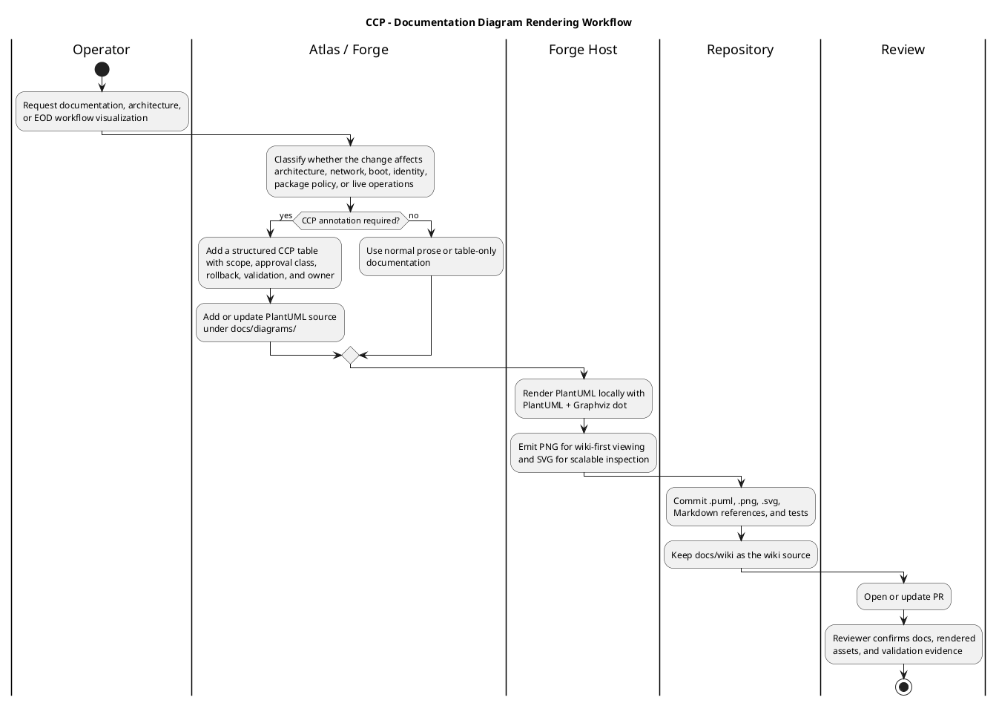

# Documentation Diagram Rendering Standard

## Purpose

Forge-resident systems must be able to render architecture, EOD, and
change-control-process diagrams locally. Local rendering keeps internal network
and host diagrams out of public rendering services, gives PR reviewers stable
assets, and lets wiki pages default to PNG images while preserving PlantUML
source for future edits.

## Standing Package Profile

Durable Gentoo policy lives in
`gentoo_stage4_llvm_split-usr_no-multilib_hardened/gentoo-liveiso-ansible/profile-definitions/documentation-diagram-renderer.yml`.

| Component | Package Atom | Required Policy | Reason |
| --- | --- | --- | --- |
| Java runtime/JDK | `dev-java/openjdk-bin` | binary JDK allowed | PlantUML package depends on a JDK-capable Java provider. |
| PlantUML | `media-gfx/plantuml` | default USE | Provides the local `plantuml` wrapper and packaged jar. |
| Graphviz | `media-gfx/graphviz` | `cairo nls` | Required for PlantUML activity diagrams and CCP swimlanes. |
| GD | `media-libs/gd` | `fontconfig jpeg png truetype zlib` | Required by Graphviz for consistent PNG output. |
| FreeType | `media-libs/freetype` | `harfbuzz png` | Required by Pango/Cairo Graphviz rendering on current Gentoo. |
| HarfBuzz | `media-libs/harfbuzz` | native compile plus scoped Portage patch for `VARC.cc` on clang 21 hosts | Required by the Pango/OpenJDK path; the M70 canary hardened LLVM profile needs a source-level override because `hb.hh` promotes `-Wextra-semi-stmt` to an error. |

## Repository Layout

| Artifact Type | Path | Rule |
| --- | --- | --- |
| PlantUML source | `docs/diagrams/*.puml` | Source files are committed and reviewed. |
| PNG render | `docs/diagrams/*.png` | Default target for wiki-facing image links. |
| SVG render | `docs/diagrams/*.svg` | Commit for scalable review and archival inspection. |
| Wiki Markdown | `docs/wiki/*.md` | Keep inline PlantUML when useful; link PNG first where image hosting is available. |
| Tests | `tests/shell/test_documentation_diagram_rendering.sh` | Assert source, rendered assets, package policy, and wiki references. |

## Rendering Command

Use local rendering only:

```bash
plantuml -checkonly docs/diagrams/*.puml
plantuml -tpng docs/diagrams/*.puml
plantuml -tsvg docs/diagrams/*.puml
```

If the packaged wrapper is unavailable, use the pinned local jar fallback:

```bash
java -Djava.awt.headless=true -jar /opt/plantuml/plantuml.jar -checkonly docs/diagrams/*.puml
java -Djava.awt.headless=true -jar /opt/plantuml/plantuml.jar -tpng docs/diagrams/*.puml
java -Djava.awt.headless=true -jar /opt/plantuml/plantuml.jar -tsvg docs/diagrams/*.puml
```

## CCP Annotation Requirements

Use a CCP table when a documentation change describes a workflow that affects
any of these architecture areas:

| Architecture Area | CCP Trigger | Minimum Documentation |
| --- | --- | --- |
| Boot and firmware | UEFI, SATADOM, ZFSBootMenu, CSM, iPXE, initramfs, microcode | boot path, rollback path, serial console path, validation evidence |
| Network fabric | LACP, OVS, VPP, DPDK, switch port movement, VLAN/IP change | NetBox state, affected links, approval gate, rollback path |
| Package policy | Portage profile, USE flags, distcc host list, binpkg policy | atoms, USE policy, affected hosts, verification command |
| Identity and access | FreeIPA, SSSD, SSH keyring, delegated controller access | source of truth, break-glass rule, dry-run/live gate |
| Hardware acceleration | QAT, GPU, vfio, uio, DPDK, kernel modules | module ownership, package support, promotion gate |

## Current M70 CCP Register

| Concern | Affected Architecture | Current Action | Status |
| --- | --- | --- | --- |
| `localhost/2` distcc recursion | Portage/distcc | Remove local distcc slots from M70 canary and primary M70 managed host lists until wrapper bypass is proven. | active correction |
| Diagram rendering dependencies | Documentation tooling | Install Java, PlantUML, Graphviz, GD, and durable USE policy on Forge-resident hosts. | validated on primary M70, M70 canary, and X12again |
| HarfBuzz clang 21 warning policy | Package policy | Keep HarfBuzz native and apply `harfbuzz-12.3.2-clang21-varc-extra-semi.patch` for the renderer dependency path. | applied and validated on M70 canary |
| Aggregate LACP proof | Network fabric | Require multi-endpoint or >1 GbE traffic generator before claiming aggregate LACP throughput. | gated |
| VPP L3 benchmark | VPP dataplane | Keep Linux `iperf3` result scoped to guest/tap/OVS path; add separate VPP L3 forwarding CCP before promotion. | gated |

## PlantUML Workflow

Rendered assets:

- PNG: `diagrams/ccp-documentation-diagram-rendering-2026-05-26.png`
- SVG: `diagrams/ccp-documentation-diagram-rendering-2026-05-26.svg`


