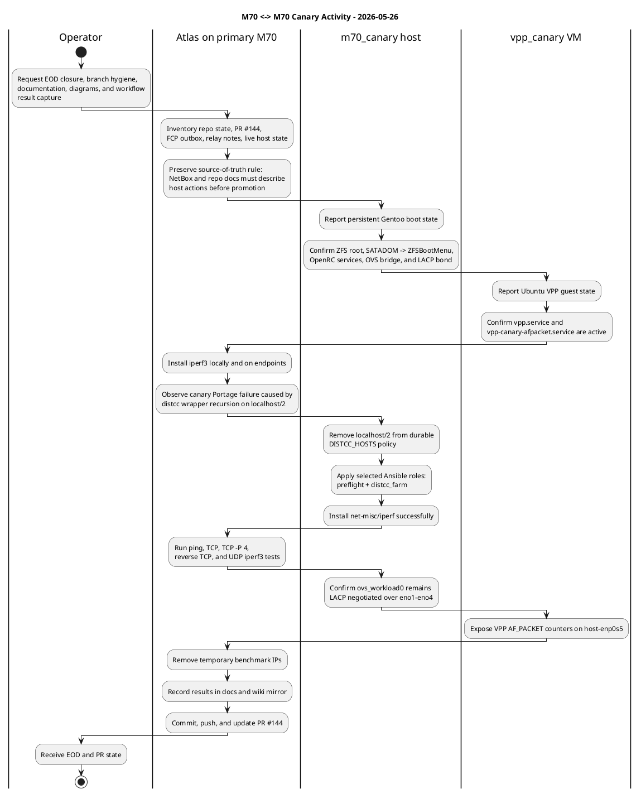
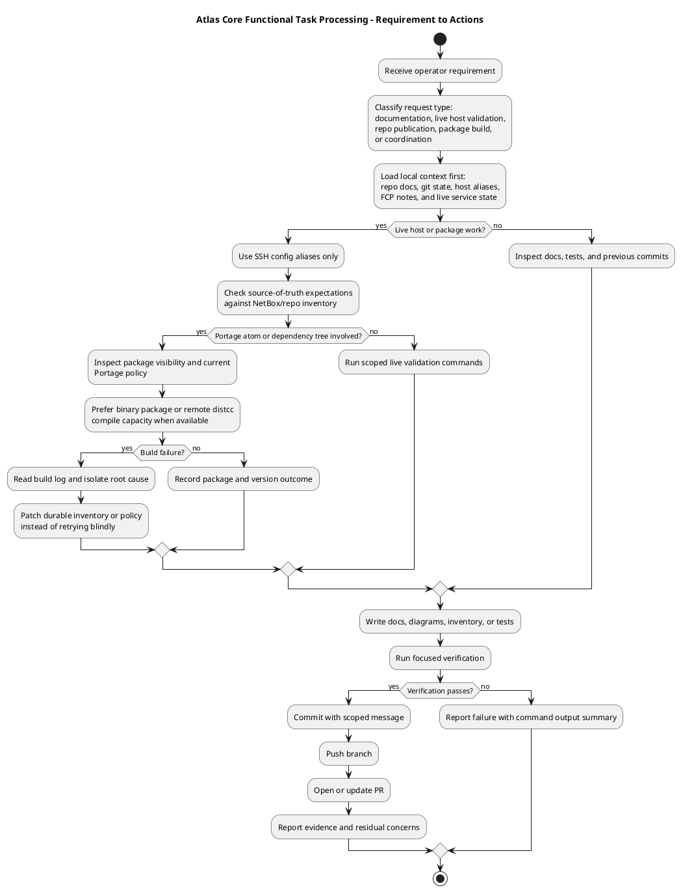
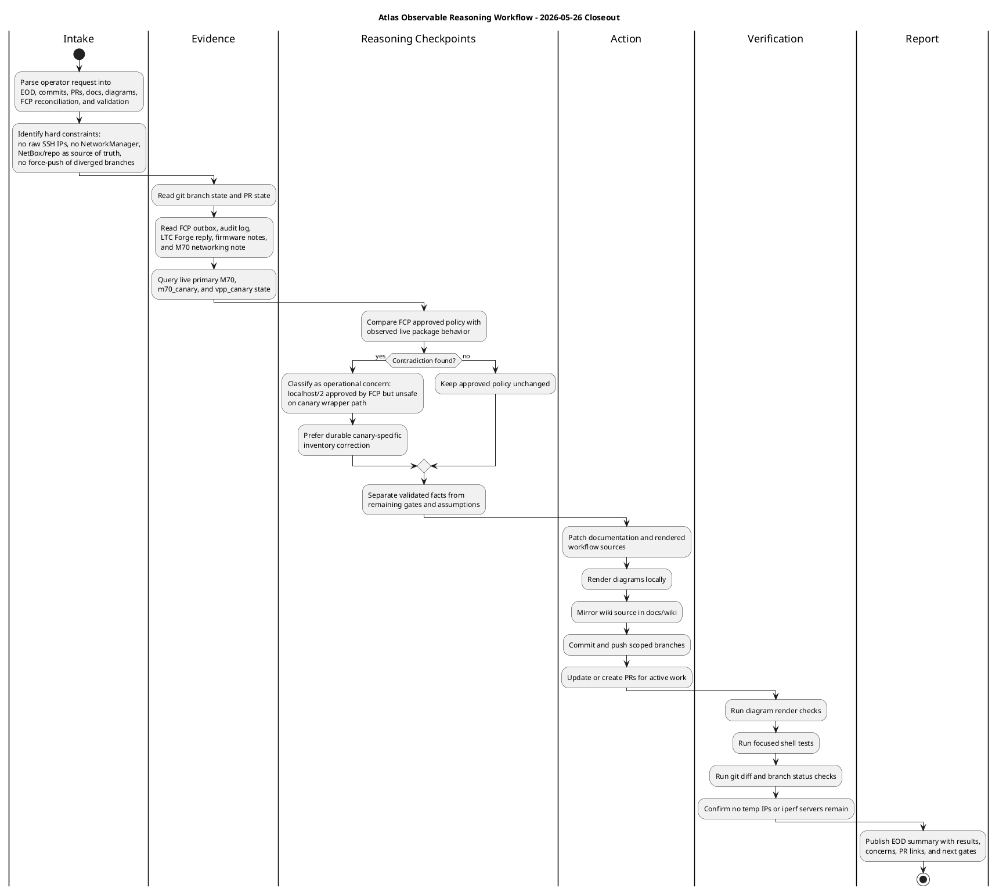

# EOD Status 2026-05-26

## Executive Summary

Atlas focused on closing the M70 canary validation lane and making the work
auditable for an outside operator. The main operational thread was:

1. keep the primary M70 stable;
2. validate the VPP canary VM on `m70_canary`;
3. correct the canary distcc policy after `iperf3` exposed local wrapper
   recursion;
4. record the live VPP/QEMU/OVS/LACP/SATADOM/UEFI/netboot findings in repo
   docs and wiki source;
5. commit, push, and update the active PR.

The active RFC branch at closeout is `m70-canary-validation-lane`, pushed at
commit `feafe21`. PR `#144` remains the active review vehicle for the M70
canary validation lane.

## Completed Work

- Installed `iperf3` on the primary M70, `m70_canary`, and the `vpp_canary`
  guest.
- Validated the VPP canary VM running on `m70_canary`, not on the primary M70.
- Confirmed `vpp_canary` services:
  - `vpp`: `active`
  - `vpp-canary-afpacket.service`: `active`
  - `host-enp0s5`: VPP AF_PACKET interface is up
- Confirmed `m70_canary` runtime state:
  - hostname/FQDN: `sbsoc-accel-int64-m70n2.rfc1918.host`
  - root: `rpool/ROOT/gentoo` mounted as `zfs`
  - ZFS pool health: all pools healthy
  - local boot command line:
    `root=ZFS=rpool/ROOT/gentoo ro console=tty0 console=ttyS0,115200 intel_iommu=on iommu=pt spl.spl_hostid=0x1709fd12`
  - `ovsdb-server` and `ovs-vswitchd`: started
  - `ovs_workload0`: LACP active/negotiated over `eno1` through `eno4`
- Corrected `m70_canary` distcc client policy:
  - removed `localhost/2` from durable `DISTCC_HOSTS`
  - retained `10.200.99.23/24,lzo` and `172.16.99.108/48,lzo`
  - retained `MAKEOPTS=-j16 -l12`
  - applied selected Ansible roles `preflight` and `distcc_farm`
- Captured the root cause of the canary build failure:
  - `net-misc/iperf` initially failed because local distcc slots invoked the
    managed wrapper recursively
  - this is a host policy issue, not an `iperf` source issue
- Ran VPP/OVS path traffic validation with temporary RFC 2544 benchmark
  addresses:
  - primary M70 `bond0`: `198.18.70.70/24`
  - `vpp_canary` `enp0s5`: `198.18.70.72/24`
  - both temporary addresses were removed after testing
- Recorded diagrams as PlantUML source and rendered PNG/SVG assets under
  `docs/diagrams/`.
- Prepared local render tooling:
  - installed `dev-java/openjdk-jre-bin`
  - installed `media-libs/gd` and `media-gfx/graphviz`
  - downloaded PlantUML `1.2026.1` to `/opt/plantuml/plantuml.jar`
  - rendered with `java -Djava.awt.headless=true -jar /opt/plantuml/plantuml.jar`
- Updated the wiki source under `docs/wiki/`.
- Updated PR `#144` with the validation evidence and residual throughput caveat.

## Validation Results

### Connectivity

- Primary M70 to `vpp_canary`: ping passed, `0%` loss, `0.652 ms` average RTT.
- `vpp_canary` to primary M70: ping passed, `0%` loss, `0.318 ms` average RTT.

### iperf3

- TCP primary M70 -> `vpp_canary`, single stream:
  - `941 Mbits/sec`
  - `0` retransmits
- TCP primary M70 -> `vpp_canary`, `-P 4`:
  - `941 Mbits/sec` aggregate
  - `0` retransmits
- TCP reverse, `vpp_canary` -> primary M70:
  - `941 Mbits/sec` receiver-side
  - `137` sender-side retransmits
- UDP primary M70 -> `vpp_canary`, `900M` target:
  - `900 Mbits/sec` received
  - `0.008 ms` jitter
  - `48/777050` datagrams lost (`0.0062%`)

### VPP And OVS Counters

- VPP observed the test traffic on `host-enp0s5`.
- Post-test VPP counters included:
  - `1,716,278` RX packets
  - `5,679,994,321` RX bytes
- The VPP drop counter increased because Linux `iperf3`, not VPP L3
  forwarding, was the endpoint in this lane.
- OVS continued to report `ovs_workload0` as `lacp_status: negotiated`.

## Documentation Updated

- `docs/M70-CANARY-VALIDATION-LANE.md`
- `docs/wiki/M70-Canary-Validation-Lane.md`
- `docs/M70-PLATFORM-OPTIMIZATION-PLAN.md`
- `docs/wiki/M70-Platform-Optimization-Plan.md`
- `docs/EOD-STATUS-2026-05-26.md`
- `docs/wiki/EOD-Status-2026-05-26.md`
- `docs/wiki/Home.md`
- `docs/wiki/_Sidebar.md`
- `docs/wiki/README.md`

Rendered diagram assets:

- `docs/diagrams/m70-canary-actions-2026-05-26.puml`
- `docs/diagrams/m70-canary-actions-2026-05-26.png`
- `docs/diagrams/m70-canary-actions-2026-05-26.svg`
- `docs/diagrams/atlas-requirement-to-actions-2026-05-26.puml`
- `docs/diagrams/atlas-requirement-to-actions-2026-05-26.png`
- `docs/diagrams/atlas-requirement-to-actions-2026-05-26.svg`
- `docs/diagrams/atlas-cognitive-workflow-2026-05-26.puml`
- `docs/diagrams/atlas-cognitive-workflow-2026-05-26.png`
- `docs/diagrams/atlas-cognitive-workflow-2026-05-26.svg`

## FCP And Flat-File Reconciliation

Reviewed local coordination artifacts:

- `/root/operator-private/fcp/outbox/20260524T162149Z-m70-slurm-controller-coordination/payload.json`
- `/root/operator-private/fcp/outbox/20260525t121702z-m70-distcc-worker-expansion-checkin/payload.json`
- `/root/operator-private/fcp/outbox/20260525t203253z-m70-distcc-worker-expansion-followup/payload.json`
- `/root/operator-private/fcp/audit.jsonl`
- `/root/operator-private/ephemeral-notes/fcp-distcc-ltc-forge.tmp.log`
- `/root/operator-private/ephemeral-notes/m70-firmware-info.md`
- `/root/operator-private/local-network/m70-forge-ovs-nics-slurm-etc.md`

Reconciliation findings:

- The FCP SLURM coordination note correctly says the canary is a rebuild/bounce
  target and should not be treated as the SLURM worker target yet.
- The FCP networking guardrails still match the repo docs:
  - no OVS-DPDK/VPP/vfio-pci binding for `eno1` through `eno4` in the current
    canary lane
  - no uncoordinated CSS326 or CCR2004 LACP mutation
  - keep VPP VM work separate from primary M70 bond cutover work
- LTC Forge's distcc reply approved:
  `10.200.99.23/24,lzo 172.16.99.108/48,lzo localhost/2`.
- Today's live canary package validation proved that `localhost/2` is unsafe on
  the canary managed-wrapper path. The repo and host now intentionally diverge
  from that part of the FCP reply for `m70_canary` only.
- The FCP caveat for `kvm-sfo200-sec-9923` still applies: it is live and useful
  as a distcc worker, but durable Podman/OCI service persistence remains a
  gate before assuming reboot survival.
- The firmware flat-file note still matches the repo position:
  - platform: AppNeta `m70 r01` / AAEON `FWS-2363 V1.0`
  - BIOS: AMI `V0472M22`, release date `2021-04-14`
  - no safe public `FWS-2363` BIOS update has been identified
  - SATADOM EFI carrier remains the correct durable boot design

## Concerns And Gates

| Concern | Follow-up Action | Current State |
| --- | --- | --- |
| Primary M70 `localhost/2` distcc entry | Removed `localhost/2` from live `/etc/distcc/hosts`; durable policy is to keep M70 documentation-rendering packages native until wrapper probe bypass is proven. | corrected live; durable profile added for documentation renderer |
| PlantUML/Graphviz/GD dependency policy | Added `documentation-diagram-renderer` profile with PlantUML, Graphviz, GD, FreeType, HarfBuzz, and native-compile package.env policy. | corrected in repo; primary M70, M70 canary, and X12again validated with `plantuml -testdot` |
| HarfBuzz clang 21 build blocker | Added a managed Portage patch for `media-libs/harfbuzz` so clang 21 accepts VARC generated macro expansion under HarfBuzz's internal warning policy. | corrected in repo; applied to M70 canary via Ansible; HarfBuzz merged successfully |
| Documentation CCP structure | Added a standing documentation diagram rendering standard with CCP tables and PlantUML workflow. | corrected in repo |
| Aggregate LACP proof | Added a benchmark CCP gate requiring multi-endpoint or faster-than-1GbE generator before claiming aggregate LACP throughput. | gated |
| VPP L3 benchmark | Kept Linux `iperf3` scoped to guest/tap/OVS path; separate VPP L3 forwarding CCP required before promotion. | gated |
- The current iperf validation reached one-member line rate. The primary M70
  source path is active-backup 1 GbE management, so this does not prove
  aggregate multi-link LACP throughput. A higher-bandwidth or multi-endpoint
  generator on the workload fabric is still required.
- The VPP canary lane uses Linux `iperf3` as the endpoint. It validates the
  guest NIC, tap, OVS, and observed VPP AF_PACKET path, but it is not yet a VPP
  L3 forwarding benchmark.
- Do not assign a production IP to `vpp_canary` `enp0s5` / NetBox `ovs-vpp0`
  unless NetBox is updated first.
- Do not bind `eno1` through `eno4` to `vfio-pci`, `uio_pci_generic`,
  OVS-DPDK, or VPP DPDK in this canary lane.
- Do not enable `sssd` by default on canary until the FreeIPA delegated
  controller SSH path and enrollment flow are working.
- Do not flash M70 BIOS without a vendor-matched AppNeta M70 / AAEON FWS-2363
  image and rollback plan.
- Keep NetworkManager masked and out of this host profile.

## Git And PR State

- RFC repo:
  - branch: `m70-canary-validation-lane`
  - pushed commit before this EOD update: `feafe21`
  - PR: `#144`
  - PR update comment:
    `https://github.com/yukon-systems/RFC_Codex_Gentoo-Stage4-LLVM/pull/144#issuecomment-4538446348`
- `YukonSYS-Standard-Definitions`:
  - `master` fast-forwarded and pushed to `2cc5c91`
- `agentic-forge-control-plane`:
  - `main` already clean and up to date at `bebb2a3`
- Preserved stale local RFC activity:
  - branch pushed as `codex/noctosultris-dns-sync-local-20260526`
  - commit: `412f180`
  - PR: `#169`
  - reason: original local branch conflicted heavily when rebased onto current
    `origin/main`, so it was preserved without force-pushing or rewriting the
    old remote branch

## PlantUML Swimlane - M70 To Canary

Rendered:

- PNG: `diagrams/m70-canary-actions-2026-05-26.png`
- SVG: `diagrams/m70-canary-actions-2026-05-26.svg`

## PlantUML - Atlas Requirement To Actions

Rendered:

- PNG: `diagrams/atlas-requirement-to-actions-2026-05-26.png`
- SVG: `diagrams/atlas-requirement-to-actions-2026-05-26.svg`

## PlantUML - Atlas Observable Cognitive Workflow

This diagram records the auditable reasoning checkpoints used today. It is an
operational process model, not a transcript of private token-by-token internal
reasoning.

Rendered:

- PNG: `diagrams/atlas-cognitive-workflow-2026-05-26.png`
- SVG: `diagrams/atlas-cognitive-workflow-2026-05-26.svg`

