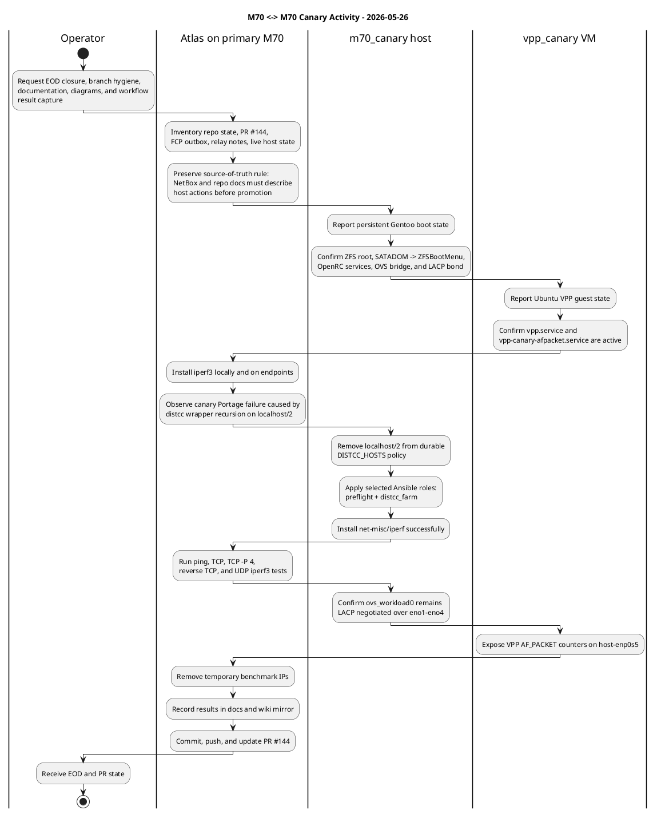

# M70 Canary Validation Lane

This runbook defines the second M70 as the blast-test node for risky boot,
network, package, OVS, VM, microVM, container, and SLURM changes before those
changes touch the primary Forge M70.

Primary Forge M70:

- `admin-sun99-forge-099070.rfc1918.host`
- Keep stable for Forge memory, ntfy/FCP, NetBox automation, operator workflows,
  and ongoing SUN99/FMT2 work.

Canary M70:

- Same baseline machine profile as the primary M70.
- Different hostname, management IPs, MACs, NetBox device record, serial path,
  local runtime state, and workload identity.
- May be rebooted, reimaged, package-tested, and network-tested without
  disrupting the primary Forge M70.

## Approved Network Topology

Use the two Intel i211 NICs for management and rescue:

| Interface | Driver | Role |
| --- | --- | --- |
| `netboot0` | `igb` | Primary management, iPXE, rescue, first boot |
| `enp3s0` | `igb` | Post-boot management backup |
| `bond-mgmt` | bonding | Active-backup management bond after boot |

Use the four Intel X553 NICs for workload networking:

| Interface | Driver | Role |
| --- | --- | --- |
| `eno1` | `ixgbe` | OVS workload LACP member |
| `eno2` | `ixgbe` | OVS workload LACP member |
| `eno3` | `ixgbe` | OVS workload LACP member |
| `eno4` | `ixgbe` | OVS workload LACP member |
| `br-ovs0` | openvswitch | Workload bridge/trunk for VM/container networks |

Management stays outside Open vSwitch. Workload bridges, VLANs, tap devices,
Kata, Firecracker, QEMU, LXC, and Podman networking belong on the X553/OVS
side.

Recommended host intent:

```text
i211:
  netboot0  -> iPXE/rescue/primary management
  enp3s0    -> post-boot management backup
  bond-mgmt -> active-backup, outside OVS

X553:
  eno1-eno4 -> OVS bond, lacp=active, bond_mode=balance-tcp
  br-ovs0   -> workload trunk for VM/container networks
```

## NetBox Intake Checklist

Create or validate these NetBox records before applying live network state:

- canary device record, site, role, and device type
- hostname, FQDN, management IP, rack placement, and serial after discovery
- six physical Ethernet interfaces with MAC addresses where known
- switch-port cabling for all six Ethernet links
- `bond-mgmt` or equivalent LAG intent for the two i211 ports
- X553 workload LAG/OVS intent for `eno1` through `eno4`
- `br-ovs0` as the workload bridge intent if modeled as a virtual interface
- prefixes and VLANs for any OVS workload networks
- RS232 console path after the USB hub power swap and canary cable install
- service records only after the canary actually runs those services

NetBox is authoritative. Host-local observations are evidence used to update
NetBox, not a replacement for NetBox.

## Confirmed Physical Intake

Operator-provided canary cabling on 2026-05-21, confirmed active by operator
report and SwOS snapshot `20260521T232928Z`:

| Canary endpoint | Connection | Role |
| --- | --- | --- |
| `netboot0` | CSS326 `ge19` | iPXE, rescue, primary management |
| `enp3s0` | CSS326 `ge20` | post-boot management backup |
| `eno1` | CSS326 `ge21` | OVS workload LACP member |
| `eno2` | CSS326 `ge22` | OVS workload LACP member |
| `eno3` | CSS326 `ge23` | OVS workload LACP member |
| `eno4` | CSS326 `ge24` | OVS workload LACP member |
| RS232 console | `/dev/serial/by-id/usb-FTDI_FT2232H_device_FT5W5FZH-if01-port0` | BIOS/iPXE console work |
| Power inlet | AP7901 PDU outlet 7 | canary power |

Known canary NIC facts:

- `netboot0`: PCI `0000:02:00.0`, driver `igb`, MAC `00:07:32:58:73:34`.
- `enp3s0`: PCI `0000:03:00.0`, driver `igb`, MAC `00:07:32:58:73:35`.
- `eno1` through `eno4`: X553 `ixgbe`, MACs `00:07:32:58:73:36`
  through `00:07:32:58:73:39`.

Required CSS326 prep:

- CRS354 `ether49` management copper was moved from CSS326 `ge24` to CSS326
  `ge15` on 2026-05-21.
- NetBox cable `4` records CSS326 `ge15` to CRS354 `ether49` as connected.
- NetBox device `m70_canary` records the active M70 canary.
- NetBox cables `5` through `10` record CSS326 `ge19` through `ge24` to the
  canary's six Ethernet interfaces.
- NetBox cable `11` records AP7901 outlet 7 to the canary power input.
- The structured inventory records Chonkers' former CSS326 `ge15` connection as
  historical.

Once the canary boots, reconcile host-observed state back to NetBox. The
remaining five NIC MAC addresses were discovered from the old HBSD/FreeBSD
shell on 2026-05-22 and have been staged into inventory intake. Do not add
service ownership until the canary actually runs those services.

## Persistent Gentoo Install Target

The canary must not depend on iPXE after installation. iPXE remains only the
installer and rescue path.

Persistent target state:

- hostname: `sbsoc-accel-int64-m70n2`
- FQDN: `sbsoc-accel-int64-m70n2.rfc1918.host`
- aliases: `m70n2.rfc1918.host`, `m70-canary.rfc1918.host`
- management IP: `172.16.99.22/24`
- boot strategy: SATADOM EFI carrier -> ZFSBootMenu ->
  `rpool/ROOT/gentoo`; legacy iPXE remains the rescue path
- storage layout: ZFS mirror across the two KIOXIA NVMe devices
- management network: `bond_mgmt` balance-alb over `netboot0` and `enp3s0`
- workload network: Open vSwitch `br_ovs0` with `ovs_workload0` active LACP
  over `eno1` through `eno4`
- SATADOM carrier runbook:
  `docs/M70-CANARY-SATADOM-EFI-CARRIER.md`

Discovered storage on 2026-05-22 from the canary RS232 console:

| OS view | Model | Serial / EUI | Install use |
| --- | --- | --- | --- |
| FreeBSD `ada0` | SATADOM-SH 3ME3 | `20180915AA9241033080` | excluded |
| FreeBSD `nda0` | KBG50ZNS256G NVMe KIOXIA 256GB | `82HPG1DLQEKK`, EUI `8ce38e0403ef1a38` | Gentoo ZFS mirror |
| FreeBSD `nda1` | KBG50ZNS256G NVMe KIOXIA 256GB | `82HPG1I8QEKK`, EUI `8ce38e0403ef1adf` | Gentoo ZFS mirror |

Expected Linux target paths:

```text
/dev/disk/by-id/nvme-eui.8ce38e0403ef1a38
/dev/disk/by-id/nvme-eui.8ce38e0403ef1adf
```

Before destructive install execution, confirm both paths exist in the Gentoo
installer environment and confirm the SATA-DOM path is not present in
`storage_devices`.

## Current Remediation State

Status captured on 2026-05-24 after the persistent Gentoo target was repaired
from the netbooted installer environment:

- Live and target host identity now resolve to `sbsoc-accel-int64-m70n2`.
- The stale `gmktek-k10-stage5` live `/etc/hosts` entry was removed.
- A scan of live `/etc`, target `/mnt/gentoo/etc`, and target
  `/mnt/gentoo/boot` found zero remaining `gmktek` or `k10-stage5`
  references.
- Target `/etc/hosts` contains:

  ```text
  127.0.0.1 localhost
  ::1 localhost
  127.0.1.1 sbsoc-accel-int64-m70n2.rfc1918.host sbsoc-accel-int64-m70n2
  ```

- Target `/etc/cmdline` and `/etc/kernel/cmdline` both carry:

  ```text
  root=ZFS=rpool/ROOT/gentoo ro console=tty0 console=ttyS0,115200 intel_iommu=on iommu=pt
  ```

- `chroot_base` now writes the target hosts file plus both kernel command-line
  locations so later install passes do not regress into host-specific stale
  identity.
- `kernel_config` is now a standalone role that runs before package and kernel
  builds. It renders profile-provided fragments into
  `/etc/kernel/config.d`.
- The canary target has
  `/mnt/gentoo/etc/kernel/config.d/90-intel-qat-c3000.config` with Intel C3000
  QAT, SR-IOV, UIO, VFIO PCI, and QAT VFIO policy.
- Live QAT validation shows `qat_c3xxx` and `intel_qat` loaded, with QAT
  heartbeat status `0`.
- Stock Gentoo package checks still did not find a ready `qatlib`,
  `qatengine`, OpenSSL QAT provider, or OpenZFS QAT package path. Kernel and
  firmware enablement is complete; userspace QAT acceleration remains a
  separate package/overlay decision.
- Live distcc remediation on 2026-05-25 applied only `preflight` and
  `distcc_farm` to the installed root at `/`. The canary now has the managed
  distcc wrapper directory and make.conf block rendered on the persistent OS.
- Effective canary Portage state after that apply:
  - `MAKEOPTS=-j24`
  - `DISTCC_HOSTS=172.16.99.108/48,lzo`
  - `DISTCC_FALLBACK=0`
  - `FEATURES` includes `distcc`
  - `PATH` includes `/usr/local/libexec/distcc-farm/bin`
- A fallback-disabled probe compile with `gcc` completed remotely on X12again,
  proving the canary is using the approved distcc target for compile work.
- LTC Forge provided a follow-up distcc expansion reply on 2026-05-25:
  - approved next host string after live validation:
    `10.200.99.23/24,lzo 172.16.99.108/48,lzo`
  - approved next `MAKEOPTS`: `-j16 -l12`
  - `kvm-sfo200-sec-9923.rfc1918.host` is validated at `10.200.99.23:3632`
    with recommended M70 slots `24`
  - X12AGAIN remains validated at `172.16.99.108:3632` with recommended M70
    slots `48`
  - caveat: the sec worker is live but still needs durable managed Podman/OCI
    service persistence before assuming reboot survival.
  - `localhost/2` was removed from the canary host string on 2026-05-26 after
    `net-misc/iperf` exposed recursive distcc wrapper invocation on local slots.
- The approved distcc expansion was applied live to the persistent canary OS on
  2026-05-25 using only selected roles `preflight` and `distcc_farm` with
  `install_target_root=/`.
- Post-apply live Portage state:
  - `MAKEOPTS=-j16 -l12`
  - `DISTCC_HOSTS=10.200.99.23/24,lzo 172.16.99.108/48,lzo`
  - `DISTCC_FALLBACK=0`
  - `/etc/distcc/hosts` matches the approved host string.
- Fallback-disabled compile probes passed from `m70_canary` to:
  - `10.200.99.23/24,lzo`
  - `172.16.99.108/48,lzo`
  - combined host string

Status captured on 2026-05-25 after SATADOM local boot validation:

- SATADOM ESP:
  `/dev/disk/by-id/ata-SATADOM-SH_3ME3_20180915AA9241033080-part1`
  with PARTLABEL `efiboot0` and FAT UUID `86DA-0813`.
- The SATADOM ESP was empty before the non-destructive copy. Backup evidence
  was written under
  `/root/m70-canary-satadom-backups/20260525T062728Z`.
- ZFSBootMenu payloads copied to the SATADOM ESP:
  - `EFI/ZBM/VMLINUZ.EFI`
  - `EFI/BOOT/BOOTX64.EFI`
- Both copied EFI files hashed to
  `1e08335d697fed772af3ecbccf1724227cdbdfa02aec221ced8a332bd44670bf`
  and were `64871424` bytes each.
- Working firmware state:
  - `CSM Support`: `Enabled`
  - `Launch PXE ROM`: `Enabled`
  - `Boot mode select`: `UEFI`
  - `Boot Option #1`: `Hard Disk:UEFI OS (P6: SATADOM-SH 3ME3)`
- Two serial-observed boots reached SATADOM -> ZFSBootMenu ->
  `/boot/vmlinuz-6.18.32-p2-gentoo-dist-hardened` ->
  `rpool/ROOT/gentoo`.
- The local-boot kernel command line is:

  ```text
  root=ZFS=rpool/ROOT/gentoo ro console=tty0 console=ttyS0,115200 intel_iommu=on iommu=pt spl.spl_hostid=0x1709fd12
  ```

- The command line no longer contains temporary iPXE artifacts such as
  `initramfs-m70-canary-zfsroot.img`, `ifname=netboot0:...`, or
  `ip=...:netboot0:none`.
- Local boot exposed the prior netboot-only NIC naming dependency:
  `netboot0` became `enp2s0` without the iPXE `ifname=` argument.

## VPP Canary VM

Status captured on 2026-05-25:

- The first VPP canary guest is running on `m70_canary`, not on the primary
  Forge M70.
- NetBox records:
  - cluster: `m70-canary-qemu` (`virtualization.clusters` id `7`)
  - VM: `vpp-canary` (`virtualization.virtual-machines` id `16`)
  - VM interfaces: `qemu-mgmt0` id `17`, `ovs-vpp0` id `18`
- Runtime launcher path on `m70_canary`:
  `/opt/gentoo-virt-qemu/qemu-launch-vpp-canary-vm.sh`
- Repo launcher path:
  `gentoo-virt-qemu/qemu-launch-vpp-canary-vm.sh`
- Guest OS: Ubuntu 24.04.4 LTS Noble cloud image.
- Guest package source: FD.io `packagecloud.io/fdio/release`.
- Installed guest packages:
  - `vpp 26.02-release`
  - `vpp-plugin-core 26.02-release`
  - `vpp-plugin-dpdk 26.02-release`
- VM resources:
  - `4` vCPU
  - `4096` MiB RAM
  - `4` GiB cloud overlay disk
- QEMU management NIC:
  - guest interface: `enp0s4`
  - MAC: `52:54:00:12:34:56`
  - QEMU backend: user-mode NAT with SSH forwarded on canary localhost port
    `2224`
  - operator alias: `ssh vpp_canary`
- OVS/VPP NIC:
  - host tap: `tap-vppcan0`
  - host bridge: `br_ovs0`
  - guest interface: `enp0s5`
  - MAC: `52:54:00:70:ca:01`
  - production IP assignment: none
  - VPP interface: `host-enp0s5` through AF_PACKET
  - persistence: guest systemd oneshot `vpp-canary-afpacket.service`

The OVS/VPP NIC briefly received `172.16.99.157/24` during the first boot
because the generic cloud-init network config matched all `en*` interfaces.
NetBox already assigns `172.16.99.157/24` to `lap_sun99_chonkers`, so this was
immediately corrected. The live guest now uses a canary netplan file that keeps
`enp0s5` L2-only, and the repo launcher now ships
`vpp-canary-network-config.yaml` so future rebuilds only DHCP the QEMU
management NIC.

Validation evidence:

- `cloud-init status --long`: `status: done`, `errors: []`.
- `systemctl is-active vpp`: `active`.
- `systemctl is-active vpp-canary-afpacket.service`: `active`.
- `vppctl show plugins` shows `af_packet_plugin.so` and `tap_plugin.so`; the
  DPDK plugin is disabled in `/etc/vpp/startup.conf` for this canary lane.
- `vppctl show interface host-enp0s5` shows the AF_PACKET interface `up`.
- Host-side OVS shows `tap-vppcan0` attached to `br_ovs0` with
  `external_ids:owner=forge`, `external_ids:role=vpp-canary`, and
  `external_ids:instance=vpp-canary`.
- `ovs_workload0` LACP remains negotiated across `eno1` through `eno4`.

Traffic validation captured on 2026-05-26:

- `iperf3` was installed on the primary M70, `m70_canary`, and the
  `vpp_canary` guest.
- `m70_canary` distcc client policy was corrected to remove `localhost/2`
  before installing `net-misc/iperf`; local slots recursively invoke the
  managed distcc wrapper on this host.
- Temporary RFC 2544 benchmark addresses were used only for the test and then
  removed:
  - primary M70 `bond0`: `198.18.70.70/24`
  - `vpp_canary` `enp0s5`: `198.18.70.72/24`
- Ping passed both directions:
  - primary M70 -> `vpp_canary`: `0%` loss, `0.652 ms` average RTT
  - `vpp_canary` -> primary M70: `0%` loss, `0.318 ms` average RTT
- `iperf3` primary M70 -> `vpp_canary`:
  - TCP single stream: `941 Mbits/sec`, `0` retransmits
  - TCP `-P 4`: `941 Mbits/sec` aggregate, `0` retransmits
  - UDP `900M` target: `900 Mbits/sec` received, `0.008 ms` jitter,
    `48/777050` datagrams lost (`0.0062%`)
- `iperf3 -R` `vpp_canary` -> primary M70:
  - TCP single stream: `941 Mbits/sec` receiver side, `137` sender-side
    retransmits
- VPP observed the traffic on `host-enp0s5`; post-test counters showed
  `1,716,278` RX packets and `5,679,994,321` RX bytes. The VPP drop counter is
  expected in this lane because Linux `iperf3`, not VPP L3 forwarding, is the
  endpoint.
- OVS continued to report `ovs_workload0` as `lacp_status: negotiated`.
  Current primary M70 `bond0` is active-backup over 1 GbE management ports, so
  these tests validate the VPP VM and OVS/LACP path at one-member line rate.
  Aggregate multi-link LACP throughput still needs a higher-bandwidth or
  multi-endpoint generator on the workload fabric.

### M70 To Canary Swimlane

Rendered PlantUML assets for this activity are stored under `docs/diagrams/`:

- `m70-canary-actions-2026-05-26.png`
- `m70-canary-actions-2026-05-26.svg`



Important guardrails:

- Do not bind `eno1` through `eno4` to `vfio-pci`, `uio_pci_generic`,
  OVS-DPDK, or VPP DPDK in this lane.
- Do not assign a production IP to `ovs-vpp0` unless NetBox is updated first
  and the address is reserved for this VM.
- Treat `tap-vppcan0` as a canary-only validation artifact. It can be removed
  by shutting down the VM and deleting the OVS port if the lane needs rollback.
- The live host now has `/etc/udev/rules.d/10-m70-canary-net-names.rules`
  with MAC-based names for `netboot0`, `enp3s0`, and `eno1` through `eno4`.
  The same rule is modeled in Ansible via `profile_udev_rules_files`.
- After the udev-rule reboot, `bond_mgmt` added both `netboot0` and `enp3s0`
  with `Currently Active Slave: netboot0`.
- Early microcode updates from revision `0x32` to `0x3e`, and QAT starts as
  `qat_dev0` with six acceleration engines.

ZFSBootMenu and initramfs state after the 2026-05-24 repair:

- `rpool/ROOT` and `rpool/ROOT/gentoo` both have
  `org.zfsbootmenu:commandline` set to:

  ```text
  ro console=tty0 console=ttyS0,115200 intel_iommu=on iommu=pt spl_hostid=1709fd12
  ```

- `rpool` has `cachefile=/mnt/gentoo/etc/zfs/zpool.cache`.
- Target dracut configs now include:
  - `90-zfs-hostid.conf`
  - `90-zfs-root.conf`
  - `95-universal-netboot-microcode.conf`
- The rebuilt initramfs at
  `/mnt/gentoo/boot/initramfs-6.18.32-p2-gentoo-dist-hardened.img` was written
  at `2026-05-24 17:36:30 UTC` and is `99570714` bytes.
- `lsinitrd` evidence shows the rebuilt initramfs includes:
  - `kernel/x86/microcode/AuthenticAMD.bin`
  - `kernel/x86/microcode/GenuineIntel.bin`
  - `/etc/hostid`
  - `/etc/zfs/zpool.cache`
  - `usr/lib/modules/6.18.32-p2-gentoo-dist-hardened/extra/zfs.ko`
  - Intel QAT firmware and `qat_c3xxx`, `qat_c3xxxvf`, `intel_qat` modules
  - `network-legacy`, `dhclient`, and `dhclient-script`

Installed-root validation on 2026-05-25 used a canary-only iPXE bridge role
served from the primary M70 at `172.16.99.70:8080`:

- iPXE role:
  `/root/m70-canary-netboot-shim/roles/m70-canary-zfsroot.ipxe`
- kernel:
  `/root/m70-canary-netboot-shim/g/vmlinuz-m70-canary-zfsroot`
- initramfs:
  `/root/m70-canary-netboot-shim/g/initramfs-m70-canary-zfsroot.img`
- kernel command line:

  ```text
  root=ZFS=rpool/ROOT/gentoo ro console=tty0 console=ttyS0,115200 intel_iommu=on iommu=pt spl_hostid=1709fd12 ifname=netboot0:00:07:32:58:73:34 ip=172.16.99.22::172.16.99.1:255.255.255.0:sbsoc-accel-int64-m70n2:netboot0:none nameserver=172.16.99.1 nameserver=9.9.9.9
  ```

Validation evidence:

- `hostname -f`: `sbsoc-accel-int64-m70n2.rfc1918.host`
- `/`: `rpool/ROOT/gentoo` mounted as `zfs`
- `rpool`: `ONLINE`, read-write, mirrored across `nvme0n1p3` and `nvme1n1p3`
- `efi=no` because this pass intentionally booted through legacy PXE/iPXE
- early microcode updated during boot from revision `0x32` to `0x3e`
- `qat_c3xxx`, `intel_qat`, `zfs`, `openvswitch`, `bonding`, and `kvm_intel`
  are loaded
- `bond_mgmt` is up at `172.16.99.22/24`
- `ovsdb-server`, `ovs-vswitchd`, and `m70-ovs-fabric` are started
- OVS has bridge `br_ovs0` and bond `ovs_workload0` over `eno1` through
  `eno4`
- `ovs-appctl bond/show ovs_workload0` reports `lacp_status: negotiated`
- root SSH uses the primary M70 `/root/.ssh/authorized_keys` keyring for the
  canary target

Two target-side fixes were made during this validation:

- `/var/lib/openvswitch/conf.db` was initialized and
  `/etc/conf.d/ovsdb-server` was pinned to
  `DATABASE="/var/lib/openvswitch/conf.db"`.
- `/usr/local/libexec/m70-ovs-fabric` was installed from the repo-modeled
  `openrc_ovs_fabric` intent so the OpenRC service can apply `br_ovs0` and
  `ovs_workload0`.

`sssd` is intentionally removed from the canary default runlevel until the
FreeIPA client enrollment apply path renders `/etc/sssd/sssd.conf` and enables
the service.

FreeIPA live apply dry-run status from 2026-05-25:

- `ipa-client-live-apply.yml --check --diff` now reaches the local canary
  config-render phase after the root break-glass check is allowed to run in
  check mode.
- The dry-run shows expected local changes for `/etc/hosts`,
  `/etc/ipa/default.conf`, `/etc/krb5.conf`, and `/etc/sssd/sssd.conf`.
- No live FreeIPA/SSSD mutation was applied. The run remains blocked at the
  delegated IPA controller step because `svc_identity_ipa01` SSH access is not
  currently accepted for this Forge shell.

## Firmware Boot State

Live RS232 firmware work on 2026-05-22 changed the canary boot settings from
the inherited disk-first profile toward netboot:

- Boot Option #1: `Network`
- CSM Support: `Enabled`
- Launch PXE ROM: `Enabled`
- Boot mode select: `UEFI`

The node still returned to Aptio Setup after reset. A concurrent `tcpdump` on
the primary M70 `netboot0` interface captured zero DHCP/TFTP/PXE packets from
canary MAC `00:07:32:58:73:34`, so the current blocker is firmware/device PXE
launch rather than the Path B host script itself. Before another install
attempt, find the concrete UEFI network boot target or per-NIC PXE enablement
for the i211 `netboot0` controller.

After the persistent ZFSBootMenu install is staged, the managed canary netboot
role is `localdisk`. If firmware still attempts PXE first, the Path B
dispatcher should match canary MAC `00:07:32:58:73:34` and chain the existing
`localdisk` iPXE role instead of falling through to the installer menu.

Follow-up boot-path validation on 2026-05-24 and 2026-05-25 found:

- The firmware reaches legacy PXE on `00:07:32:58:73:34` and loads iPXE from
  the local M70 shim before any local NVMe EFI payload.
- iPXE nested `exit` returns to the parent script; it did not force the BIOS to
  proceed to a local disk boot path.
- `sanboot --drive 0x80` reaches the stale SATA-DOM FreeBSD/ZFS loader path and
  fails to find `/boot/zfsloader`, `/boot/loader`, or `/boot/kernel/kernel`.
- `sanboot --drive 0x81`, `0x82`, and `0x83` returned input/output errors.
- Serial key-spam for `DEL`/`ESC` and iPXE `reboot --setup` did not enter
  setup from automation.
- The NVMe EFI payloads still exist on both ESPs, but firmware ordering/mode
  must be corrected manually or the SATA-DOM must be explicitly repurposed
  before the canary can boot persistently without the temporary iPXE bridge.

Operator BIOS inspection on 2026-05-25 refined the boot-path decision:

- BIOS main screen identifies the build as
  `m70 R2.2 (V0472M22)(04/14/2021)`.
- DMI identifies the platform as AppNeta `m70 r01` on AAEON `FWS-2363 V1.0`.
- Public AAEON download trees expose nearby `FWS-2360` and `FWS-2365` BIOS
  directories, but direct `FWS-2363` BIOS paths returned 404. No safe public
  vendor-matched BIOS update was found.
- Do not cross-flash `FWS-2360` or `FWS-2365` firmware onto this board.
- With CSM disabled, no new NVMe boot options appeared.
- UEFI BBS priorities list the SATADOM and `none`; direct NVMe boot is not an
  accepted assumption for these nodes.
- CSM-enabled mode remains the known recovery path for legacy PXE/iPXE.

Accepted durable boot direction: SATADOM EFI carrier.

1. Keep Gentoo root and data on the mirrored NVMe ZFS `rpool`.
2. Use the SATADOM only as the persistent EFI boot carrier.
3. Put the fallback EFI loader at `EFI/BOOT/BOOTX64.EFI` on the SATADOM ESP.
4. Boot ZFSBootMenu from the SATADOM, then import and boot
   `rpool/ROOT/gentoo` from the NVMe mirror.
5. Keep the legacy iPXE path as recovery, not as the normal boot dependency.

Implementation status on 2026-05-25:

- The non-destructive SATADOM ESP copy was approved and completed.
- Destructive SATADOM conversion was not needed.
- SATADOM local boot succeeded twice.
- The remaining boot-path work is promotion hardening: keep the iPXE bridge as
  rescue until the same SATADOM carrier procedure is repeated on the next M70
  node and the udev naming rule is generated by the standard profile apply.

## Serial-Hub Handling

During USB hub power changes, all attached serial paths are considered
temporarily unavailable. Do not run serial probes or RouterOS console helpers
while the hub is being moved.

After power is stable:

```bash
ls -l /dev/serial/by-id/
udevadm info --query=property --name=/dev/ttyUSB0
```

Repeat for each present `/dev/ttyUSB*` device as needed. Update
[`M70-SERIAL-CONSOLE-MAP.md`](M70-SERIAL-CONSOLE-MAP.md) and NetBox only after
stable by-id paths are confirmed.

Current canary serial path:

```text
/dev/serial/by-id/usb-FTDI_FT2232H_device_FT5W5FZH-if01-port0
```

Passive capture and newline validation on 2026-05-22 reached the old
HBSD/FreeBSD root shell prompt:

```text
root@pkg-cip-hbsd-int64-m70n2:~ #
```

## Validation Gates

### 1. Cable And Inventory Gate

Required evidence:

- power is stable
- all six Ethernet links are physically cabled
- RS232 is physically attached
- NetBox has the canary device, interfaces, Ethernet cabling, and power cabling
- `/dev/serial/by-id` is stable after the USB hub power swap
- CSS326 `ge15` is recorded as CRS354 management, not Chonkers LOM
- CSS326 `ge19` through `ge24` match the canary physical cabling plan
- management IP, hostname/FQDN, and serial intent are added after discovery

Do not continue to OVS testing until this passes.

### 2. Boot Gate

Required evidence:

- canary boots from `netboot0`
- canary reaches the expected hostname/FQDN
- serial console is reachable
- primary Forge M70 remains reachable while the canary is rebooted or broken

Microcode/IOMMU tests should run here first because they require boot-path
changes.

### 3. Management Network Gate

Required evidence:

- management uses the approved i211 design
- `netboot0` remains a rescue path
- `enp3s0` participates only in management backup after boot
- management traffic is not dependent on OVS
- failover is tested by dropping one management member at a time

Preferred management mode is `active-backup`. Do not use `balance-alb` on the
primary profile unless it is intentionally tested as a canary-only experiment.

### 4. X553 OVS/LACP Gate

Required evidence:

- `eno1`, `eno2`, `eno3`, and `eno4` all link up
- switch side reports one healthy 802.3ad LAG
- OVS side reports active LACP and the expected member state
- `br-ovs0` remains reachable for workload networks after one member is dropped
  and restored
- management remains reachable if `br-ovs0` is misconfigured

The X553/OVS side is the blast zone. The i211 side is the recovery path.

### 5. Runtime Network Gate

Validate each workload path independently:

| Runtime | Required check |
| --- | --- |
| QEMU | VM tap reaches the expected test VLAN or bridge network |
| Firecracker | microVM tap works after package source is selected |
| Kata | Kata network path works after package source is selected |
| Podman | container network works without stealing management reachability |
| LXC/namespace | selected namespace path works if included in the M70 profile |

Do not collapse these into one generic "network works" result. Each runtime has
different failure modes.

### 6. Promotion Gate

Before promoting a canary-tested change:

- capture evidence in a repo doc, issue, PR, or append-only Forge memory event
- verify NetBox has no known drift for the canary
- write the rollback path
- confirm primary Forge M70 is still clean
- promote in rings: canary, primary Forge M70 if appropriate, then additional
  M70 workers

## Initial Canary Test Queue

1. Intel+AMD early microcode boot artifact order.
2. `intel_iommu=on iommu=pt` boot posture.
3. M70 runtime package policy for Podman, QEMU, SLURM, MUNGE, and support
   tooling.
4. Firecracker package source decision and smoke test.
5. Kata package source decision and smoke test.
6. X553 OVS four-port LACP with workload VLAN trunk.
7. Runtime-specific tap/network validation.
8. SLURM worker enrollment after canary runtime/network gates pass.

## Non-Goals

- Do not move primary Forge control-plane duties to the canary.
- Do not make OVS part of the management recovery path.
- Do not apply workload VLANs before NetBox has the intended prefixes and
  cabling.
- Do not treat canary host-local state as authoritative inventory.
